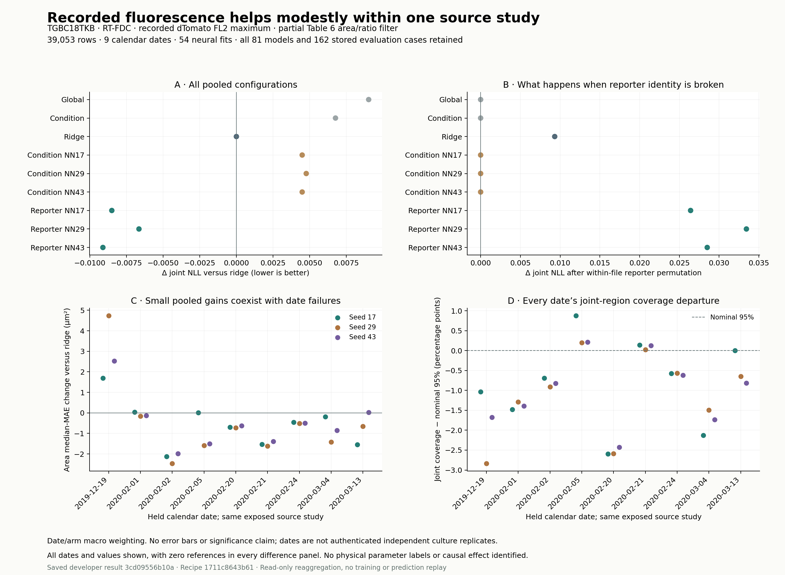

# 같은 이벤트의 형광·면적·변형: 외부 학습의 작은 개선과 날짜별 실패

Atlas에서 발굴해 전달한 JO01 공동 관측으로 외부 개발자가 수행한 학습이다. **형광과 명목 조건을 입력받는 신경망은 이번 개발 평가에서 ridge보다 면적 오차를 0.75–0.82%, 변형 오차를 0.20–0.29% 줄였다.** 날짜별 결과는 일관되지 않았다. 첫 날짜에서는 세 초기값 모두 ridge보다 면적 오차가 커졌다. 같은 연구의 이미 노출된 자료이므로 독립 연구로의 일반화, 인과효과, 엔진 파라미터의 식별을 뜻하지 않는다.

[PDF](cytometry_learning_scores.pdf) · [SVG](cytometry_learning_scores.svg) · [재집계 기록](cytometry_learning_review.json)

## 어떤 자료와 관계를 학습했는가

원 연구 TGBC18TKB의 20개 export는 67,449행이다. 날짜는 9개이며, 서로 다른 세션명이 붙은 2020-03-13 자료를 같은 날짜로 묶었다. 면적 60–600 µm²와 area ratio 1–1.05의 부분 필터를 적용한 **39,053행**을 사용했다. 저자의 fluorescence·aspect-ratio gating 전체를 재현한 모집단은 아니다. 원본 row와 DOI·파일·행 식별자를 유지하며, 두 merged 파일의 반복 index를 전역 event ID로 쓰지 않는다.

입력은 기록된 FL2 형광(a.u.)과 파일의 명목 조건이고, 출력은 같은 이벤트의 면적(µm²)과 변형이다. 계산된 탄성률·부피, 원인 미확정인 temp=0을 정답이나 물리 온도로 사용하지 않았다. 형광 최솟값의 반복은 일부 원본 RTDC에도 이미 존재하지만, 생성 원인·검출 한계는 미확정이다. [원본 검토](JO01_RAW_REVIEW.md), [처리 경로](JO01_PROCESSING_REVIEW.md)를 함께 읽어야 한다.

각 날짜를 한 번씩 평가에 남기고, 다음 날짜는 모델 선택, 나머지 7개 날짜는 적합에 사용했다. 날짜 안에서는 두 명목 조건에 같은 무게를 주고, 조건 안의 이벤트에는 같은 무게를 줬다. 따라서 세션 네 개가 있는 3월 13일도 파일별 평균을 단순 평균하지 않는다. 날짜는 확인된 독립 배양 반복이 아니며, 표본 수 39,053을 독립 실험 수로 해석하지 않는다.

고정 계획 `1711c8643b6104a7f9b66807143ef928747b381f` 이후 54개 신경망 적합과 27개 기준선을 만들었다. 신경망은 조건만 사용하는 모델과 형광을 추가한 모델에 각각 초기값 17·29·43을 사용했다. 선택 시점 0·50·100·150·200을 보존했고, 평가 날짜로 추가 적합하지 않았다. 결과 commit은 `3cd09556b10a28f9a788aee4fe7c7631d29d9184`이며 아래 비교는 그 저장 결과에 고정된다.

## 저장된 수치

모든 값은 9개 날짜의 동일 가중 평균이다. NLL은 원래 관측 단위의 공동 분포에 대한 음의 로그가능도로 작을수록 좋다. MAE는 예측 중앙값의 절대오차다. Joint95는 명목 95% 공동 영역 안에 실제 두 관측이 들어온 비율이다.

| 모델 | 공동 NLL ↓ | 면적 MAE (µm²) ↓ | 변형 MAE ↓ | Joint95 |
|---|---:|---:|---:|---:|
| 전체 상수 기준선 | 2.342213 | 65.5422 | 0.00705738 | 94.526% |
| 조건별 기준선 | 2.339950 | 65.5499 | 0.00705221 | 94.472% |
| Ridge | 2.333191 | 65.1207 | 0.00705211 | 94.499% |
| 형광 NN, 17 | 2.324694 | 64.5874 | 0.00703809 | 94.168% |
| 형광 NN, 29 | 2.326546 | 64.6307 | 0.00703138 | 93.875% |
| 형광 NN, 43 | 2.324086 | 64.6280 | 0.00703742 | 93.984% |

조건만 받는 신경망의 세 초기값도 그림과 JSON에 모두 보존했다. 형광을 같은 파일 안에서 다른 이벤트와 섞으면 형광 신경망의 공동 NLL은 2.351104·2.359977·2.352589로 악화된다. 조건 전용 모델은 이 조작에 정확히 불변이다. 개별 이벤트의 형광 대응이 이번 예측에 쓰였다는 관측이며, 형광이 역학을 직접 바꾼다는 인과 검정은 아니다.

학습된 두 출력의 상관을 0으로 바꾸고 주변분포를 유지하면 NLL은 2.423294·2.424092·2.422716이다. 같은 이벤트의 두 관측 사이에 남은 의존성을 보존하는 이득이다. 이 상관계수는 면적·변형이라는 관측의 조건부 상관이며, 엔진 파라미터의 공분산이 아니다.

95% 포함률은 날짜·초기값별 약 92.16–95.88%다. 전체 NLL 개선이 포함률의 일관된 개선을 뜻하지 않는다. 로그정규 분포는 변형의 상한 1을 엄밀히 지지집합에 반영하지 않으며, 저장 결과의 초과확률은 최대 약 6.51×10⁻¹⁵였다. 부분 필터의 면적 범위 밖에도 확률을 준다. 원본 예측을 사후 자르거나 다시 정규화하지 않았다.

## 이 atlas에서 별도로 확인한 것

고정 결과의 9개 파일과 적합 전 계획을 Git 객체·SHA256으로 읽었다. **162개 평가 case와 18개 pooled 결과**를 모두 유지하고, 이벤트 수로 파일→조건을 합산한 뒤 조건→날짜→전체 평균을 다시 계산했다. 저장 JSON·CSV의 **990개 집계 수치**가 맞으며, headline 개선율과 날짜별 차이도 다시 계산했다. 계획의 적합·선택·평가 날짜가 겹치지 않는지와 불리한 case가 빠지지 않았는지 검사했다.

이 검토는 저장 집계의 독립 재계산이다. 모델을 불러와 예측·적합을 다시 수행하지 않았고, 개발자 자신의 원자료 전량 검사·재생 기록은 별도 출처 필드에 보존했다. 부트스트랩 신뢰구간, 새로운 유의성 기준 또는 독립 실험 성공 판정을 만들지 않았다.

다음으로 의미 있는 질문은 추가 관측 하나가 **주어지지 않은 다른 관측**의 예측을 개선하는지다. 제공한 관측을 다시 정답으로 채점하면 개선을 과장하므로, 두 방향을 구분하고 추가 관측을 섞은 비교도 함께 보존해야 한다. 외부 개발자는 이 후속 작업을 별도로 진행 중이며, 위 고정 결과와 섞지 않는다.
