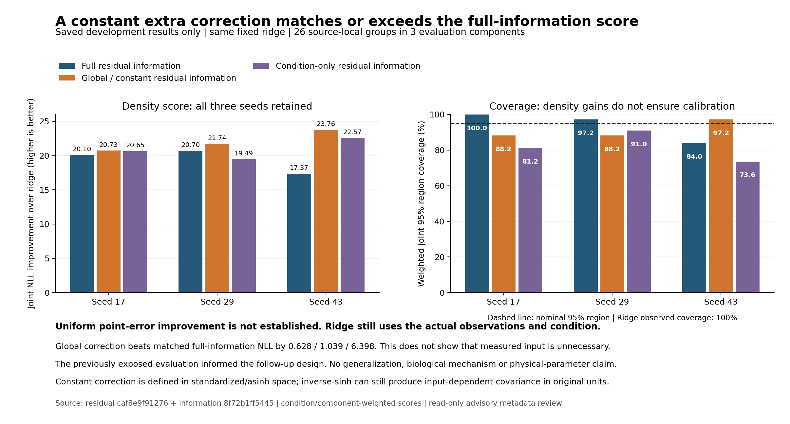

# 저장된 외부 관측 학습 후속 검토

**공동 분포 점수 개선은 확인했지만, 추가 신경망이 새 조건부 관계를 배웠다는 증거는 얻지 못했다.** 상수 잔차 보정이 같은 개발 평가에서 세 seed 모두 전체 정보 보정보다 좋았다. 점예측과 포함률 한계도 남는다.

이 파일은 저장된 자료를 읽은 advisory 검토다. 학습·모델·물리 실행을 하지 않았고, 원문 측정값을 현재 파라미터 정답이나 prior로 전환하지 않았다.

## 보존한 결과

같은 출처 로컬 그룹의 명목 0.5 nN 응답으로 1 nN 응답을 예측한다. 힘 진폭 N, 위상 차이 deg, 부호를 유지한 압입 m × 10개 주파수의 30차원이다. 파일명 설정힘은 보정된 실제 힘 궤적이 아니다.

가중은 조건 → 조건 내 보수적 출처 성분 → 로컬 그룹 순으로 균등하다. 104/31/26개 fit/selection/evaluation 그룹과 8/3/3개 성분을 유지했다. 161그룹은 인증된 독립 세포 수가 아니며, seed도 생물학적 반복이 아니다.

| 모델 | 공동 NLL ↓ | 같은 ridge 대비 개선 ↑ | 힘 MAE pN | 위상 MAE deg | 압입 MAE nm | 공동 95% 포함률 |
|---|---:|---:|---:|---:|---:|---:|
| reference_ridge | -388.482420 | 0.000000 | 24.355 | 1.752 | 147.202 | 100.00% |
| residual_joint_17 | -408.582035 | 20.099615 | 24.409 | 1.774 | 149.583 | 100.00% |
| residual_joint_29 | -409.179243 | 20.696823 | 24.389 | 1.766 | 146.533 | 97.22% |
| residual_joint_43 | -405.847913 | 17.365494 | 24.326 | 1.746 | 146.771 | 84.03% |
| information_global_17 | -409.209587 | 20.727168 | 24.455 | 1.759 | 144.886 | 88.19% |
| information_global_29 | -410.218516 | 21.736096 | 24.363 | 1.768 | 148.143 | 88.19% |
| information_global_43 | -412.245423 | 23.763003 | 24.444 | 1.805 | 146.913 | 97.22% |
| information_condition_17 | -409.134202 | 20.651782 | 24.460 | 1.747 | 145.859 | 81.25% |
| information_condition_29 | -407.975281 | 19.492861 | 24.411 | 1.754 | 146.054 | 90.97% |
| information_condition_43 | -411.055519 | 22.573099 | 24.328 | 1.773 | 147.792 | 73.61% |

점오차는 원래 단위의 **주변 중앙값** 예측에 대한 MAE다. NLL은 같은 N/deg/m 좌표에서만 비교한다. 포함률은 조건·성분 가중된 30차원 공동 영역 포함률이며 주변 구간 포함률과 다르다.

기존 mean-only 보정은 seed 17/43이 epoch 0을 선택하여 ridge와 같았고, seed 29는 힘·위상 오차가 나빠졌다. 세 결과 모두 JSON에 보존했다. Full joint 17의 공동 포함률은 ridge처럼 100%이므로 모든 seed에서 하락했다고 표현하지 않는다. 29는 97.22%, 43은 84.03%다.

Global은 추가 보정 신경망의 표준화된 관측값·조건 feature를 0으로 제한한다. Condition은 추가 신경망에 조건만 남긴다. **전체 예측기의 ridge는 계속 실제 30차원 관측값과 조건을 사용한다.** 따라서 실측 입력이나 생물학적 조건이 불필요하다는 결론은 아니다. asinh 공간에서 상수인 보정도 역변환 이후 원래 단위 공분산은 입력에 따라 달라질 수 있다.

## 이번 검토가 직접 확인한 것

두 saved commit의 REPORT/HANDOFF/PLAN/SCORES/METRICS 12파일을 사전 고정 SHA-256 및 현재 파일과 대조했다. 네 PLAN 파일은 prefit Git 객체와도 같다. 분할 목록의 중복·누락, 17개 선택된 pooled 행의 CSV/JSON 수치와 분모, 두 실험 간 기존 비교 모델 8개 metric 사전의 일치를 확인했다. METRICS 전체를 복사하지 않았다.

| 실험 | prefit plan/code commit | saved result commit |
|---|---|---|
| residual | `5f964ab94a0e074be6c1411015bd3313c3377126` | `caf8e9f91276a3951c944c1795c61edeb5542d64` |
| information | `2ffa07df43465a4f140947ce2e5f8d373e9a66ba` | `8f72b1ff54456d2f7d3eb1843674b7b05d682612` |

모든 파일 SHA·Git 객체 locator·선택 METRICS pointer·원래 값·단위 변환은 [JSON](external_followup_review.json)에 있다. 원본 intake `e11e507144895cecd829f14ff8cd9e35f8497324`와 기존 ridge에 대한 SHA map이 양 계획에서 같다는 점을 확인했다. **이 wrapper가 해당 원본 TSV·모델 파일을 새로 해시 검산하거나 fitting 시각·실행 정보 흐름을 검증한 것은 아니다.**

개발자 보고에 따르면 잔차 실험은 40개 테스트, 6개 재학습, 14개 API/portable 호출 및 원문·dense 검산을, 정보 ablation은 29개 테스트, 6개 재학습, 20개 호출 및 같은 종류의 검산을 통과했다. 이는 해시로 고정된 REPORT의 주장으로 인용하며 **이번 검토의 독립 재실행 결과가 아니다.**

## 해석의 한계

각 실험은 200회 갱신, 0/50/100/150/200 시점과 seed 17/29/43을 사전 계획에 고정했다. 시점은 selection NLL로만 선택하고 재학습하지 않는다고 명시했다. 그러나 구조와 후속 ablation 설계는 이미 노출된 평가 결과를 보고 결정했다. 새로운 독립 검증, 통계적 유의성, 일반화, 보정 보증 또는 최적 seed 선택이 아니다.

완전한 관측 공분산은 엔진 파라미터의 실측 공분산이 아니다. 생물학적 변이와 반복 평균의 측정 잡음이 분리되지 않았고, 출판 후처리 보정 적용 여부도 미확인이다. 원래 부호와 무제한 실수 지지의 음수 힘·범위 밖 위상 한계를 유지한다. 더 넓은 입력 의존 관계의 부재를 증명하지 않는다.

## 다시 생성

소스 worktree에 위 두 commit과 동일한 파일이 있어야 한다. 바이트가 다르거나 누락되면 결과를 새로 쓰기 전에 중단한다. Python 표준 라이브러리로 읽고 matplotlib로 그림만 작성한다.

[Code block omitted from the public edition; the surrounding record and references are retained.]
