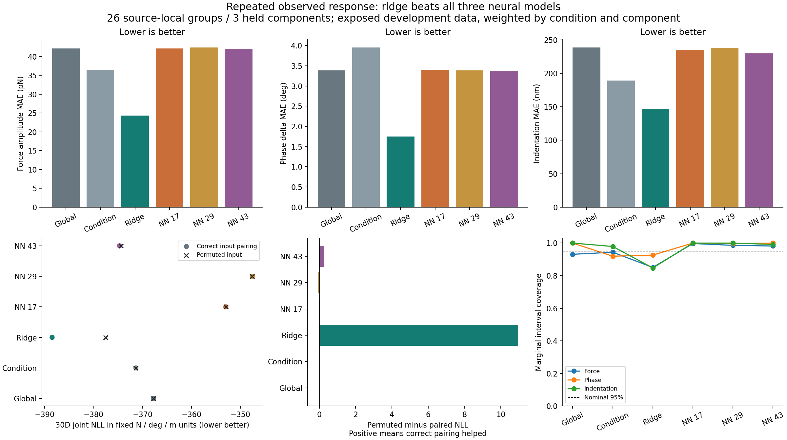

# 자료 정리에서 실제 학습으로 이어진 첫 결과

이번 조사에서 전달한 Pørtner 연구의 공개 자료를 외부 신경망 개발자가 입수·정리하고, 실제 응답 예측 실험을 마쳤습니다. **첫 실험에서는 선형 ridge가 세 신경망보다 좋은 결과를 냈습니다.** 자료를 더 확보한 성과와 신경망 성능의 개선 여부를 구분합니다.

자료는 [Pørtner et al. 2026](https://doi.org/10.1038/s44341-026-00046-6)의 [Zenodo 20122833](https://zenodo.org/records/20122833) 중 작은 export 파일입니다. 약 49 GB 전체 archive를 확보했다는 뜻은 아닙니다. 161개 출처 로컬 그룹에서 명목 0.5 nN 설정의 반복 평균으로 같은 그룹의 1 nN 응답을 예측합니다. 힘 진폭·위상·압입량 × 10개 주파수를 유지한 30차원 문제입니다.

## 첫 개발 평가

| 모델 | 공동 NLL ↓ | 힘 MAE (pN) ↓ | 위상 MAE (°) ↓ | 압입 MAE (nm) ↓ | 입력 대응 교란 시 NLL 변화 |
|---|---:|---:|---:|---:|---:|
| 전체 분포 기준 | -367.798 | 42.198 | 3.389 | 238.904 | 0.000 |
| 조건별 기준 | -371.372 | 36.517 | 3.956 | 189.415 | 0.000 |
| Ridge | **-388.482** | **24.355** | **1.752** | **147.202** | **+10.940** |
| NN 17 | -353.004 | 42.148 | 3.391 | 235.257 | +0.023 |
| NN 29 | -347.565 | 42.475 | 3.383 | 238.090 | -0.089 |
| NN 43 | -374.710 | 42.054 | 3.381 | 229.839 | +0.288 |

조건·component 가중 결과이며, MAE는 원래 단위의 주변 중앙값 오차입니다. 공동 NLL은 N/deg/m 좌표를 고정했을 때만 비교합니다. 음수 NLL 자체는 오류를 뜻하지 않습니다. 마지막 열은 같은 조건 안에서 30차원 입력 전체의 대응을 바꾼 값에서 올바른 대응 값을 뺀 것입니다. 양수이면 올바른 입력 대응이 도움이 된 것입니다. 이 실험의 신경망은 ridge에 비해 이 차이가 작았습니다.

그림은 외부 개발자가 저장한 결과를 바이트 그대로 보존한 것입니다. [PDF](external_learning_first_results.pdf)와 [전체 정밀도 요약·출처 해시](external_learning_first_review.json)를 함께 제공합니다.

## 분리와 해석 범위

14개 보수적 component를 8/3/3으로 나누어 104 fit / 31 selection / 26 evaluation 그룹을 배정했습니다. 161개를 독립적인 생물학적 세포 161개로 해석하지 않습니다. 원자료와 기술 통계가 이미 열람된 단일 출처 자료이므로 **개발 평가**입니다. 신경망은 seed 17/29/43에서 각각 epoch 200/200/150을 selection NLL로 골랐고, 평가 자료를 모델 선택에 사용하지 않았다는 저장 계획을 보존했습니다.

95% 공동 영역 포함률이 모두 1.0인 것은 보정 보증이 아닙니다. Ridge의 주변 95% 구간 포함률은 힘·위상·압입에서 약 85.1%, 92.6%, 84.7%입니다. 점 예측이 좋아도 불확실성 표현이 충분하다는 결론은 따르지 않습니다.

측정 잡음과 생물학적 변이를 분리하지 않았고, 논문의 후처리 보정이 이 export에 적용되었는지 미확인입니다. 조건 문자열은 원본 토큰으로 남았습니다. 압입 좌표의 부호를 포함해 원본 정의를 유지하며, 양수 지지나 원형 위상 분포를 새로 가정하지 않습니다. 세포 높이·이동·라민, 피질 장력·점도 또는 엔진 입력의 정답을 이 학습에 부여하지 않았습니다.

## 남긴 연결 기록

- 입수 저장본: `e11e507144895cecd829f14ff8cd9e35f8497324`.
- 학습 전 계획: `665b3aec5574ee228d6defba475dc59a24650bd1`.
- 첫 결과 저장본: `ffae7bbf4a0e218553eb9c3355a0f7929f98ae05`.
- 외부 개발 폴더의 `aleph/outputs/outer/repeated_rheology_learning_20260929/`에 계획·모델·실제 호출·원래 평가 결과가 있습니다.

이 atlas 검토는 보고서, 계획, 지표, 상태, 그림 등 9개 파일이 해당 Git 객체와 일치하는지 확인하고 요약 계산을 했습니다. 학습과 개발자의 전체 검산을 다시 실행하지 않았습니다. 개발자가 저장한 검산 영수증은 작성 주체를 표시해 인용합니다. 후속 잔차 학습 실험은 별도의 개발 결과로 평가해야 하며, 이 첫 실험 기록을 덮어쓰지 않습니다.
