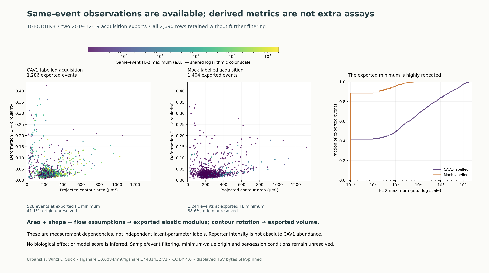

# 함께 관측한 값과 계산된 값의 차이

이 그림은 새 후보 JO01에서 저장한 **2019-12-19의 두 TGBC18TKB acquisition 표**를 보여 줍니다. 세포 이벤트의 면적·변형·형광이 같은 행에 있습니다. 원본 2,690행을 추가 필터 없이 모두 표시했으며, 전체 연구를 대표하는 효과나 학습 성능을 추정하지 않았습니다.

[PDF](joint_observation_sample.pdf) · [SVG](joint_observation_sample.svg) · [수치·파일 해시](joint_observation_sample.json) · [저자·라이선스](candidate_sources/joint_observation/ATTRIBUTION.md)

왼쪽과 가운데 그림은 같은 면적·변형 축과 같은 로그 형광 색 범위를 사용합니다. 오른쪽은 원본 FL-2 maximum의 누적 분포이며 x축만 로그입니다. 표시 과정에서 값을 바꾸거나 이상치를 버리지 않았습니다.

| 원본 acquisition | 표시한 이벤트 | 정확히 같은 FL 최솟값에 있는 이벤트 | 비유한 파생 탄성률 |
|---|---:|---:|---:|
| CAV1-labelled | 1,286 | 528 (41.1%) | 112 |
| mock-labelled | 1,404 | 1,244 (88.6%) | 92 |

공통 최솟값은 원본에 저장된 **0.10000000149 a.u.**입니다. 이렇게 많이 겹치는 이유가 검출 한계인지, 처리 과정의 치환인지, 다른 이유인지는 확인되지 않았습니다. 형광을 매끄러운 연속 분포라고 가정하기 전에 원시 취득·처리 과정을 조사할 이유입니다. 이 관찰만으로 검열 모형이나 임계값을 정하지 않습니다.

`deform=1−circ`이므로 두 열은 별개의 관측이 아닙니다. `emodulus`는 면적·변형·유동 조건에 기반한 계산값이며 `volume`도 contour로부터 계산됩니다. 탄성률이 없는 204행도 면적·변형·형광 그림에서 빠지지 않았습니다. reporter 형광은 절대 CAV1 단백질량이 아닙니다.

표본 단위는 출처 파일명과 index로 식별한 이벤트입니다. 두 파일의 index가 같다고 같은 세포로 잇지 않습니다. 최종 논문의 gating을 재현하지 않았고 export의 기존 필터 이력도 미확인입니다. 전부 0인 temp 열은 0°C 실험의 증거가 아닙니다. 세포주 전이·생물학적 반복·세션별 조건을 판정한 자료가 아니므로 이 그림에서 MCF7 엔진 입력을 추정하지 않습니다.

원자료: Marta Urbanska, Maria Winzi, Jochen Guck, [Mechanomics RT-DC Validation - TGBC CAV1 OE v2](https://doi.org/10.6084/m9.figshare.14481432.v2), [CC BY 4.0](https://creativecommons.org/licenses/by/4.0/). 원문·전체 ZIP manifest·후속 intake 질문은 [JO01](joint_observation_candidates_v2.md)에 있습니다.

재생성: 프로젝트 환경에서 `-m aleph.outer.parameter_atlas.joint_sample_view --out aleph/outputs/outer/parameter_atlas_20260929`. 원본 파일의 해시·열·표시 좌표의 유한성·양수 형광·파일별 index 유일성을 먼저 확인합니다. 학습·원문 저자 코드·물리 모듈을 실행하지 않습니다.
