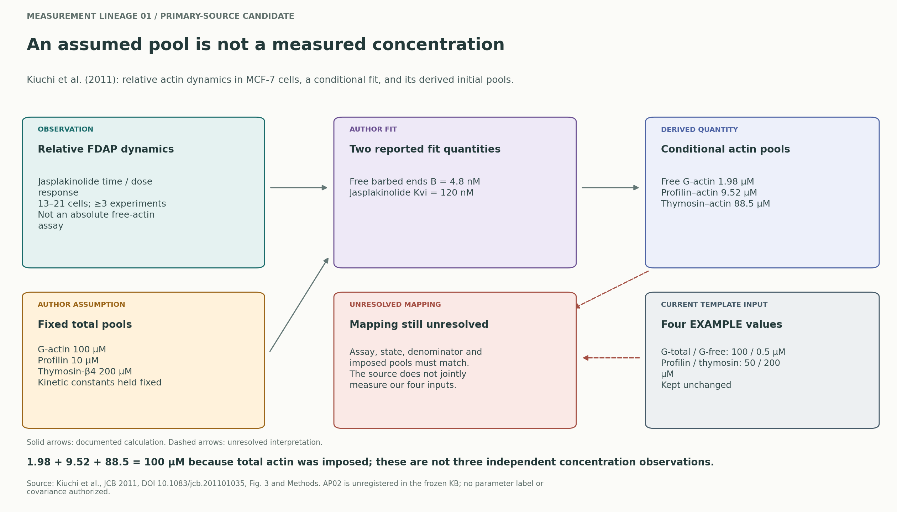
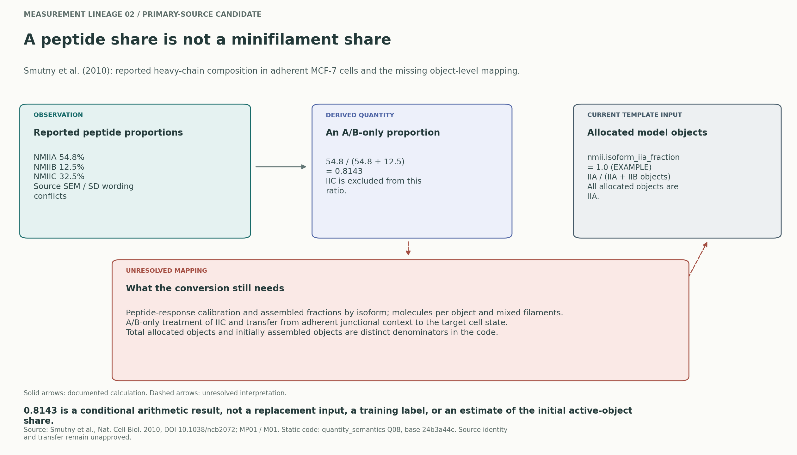
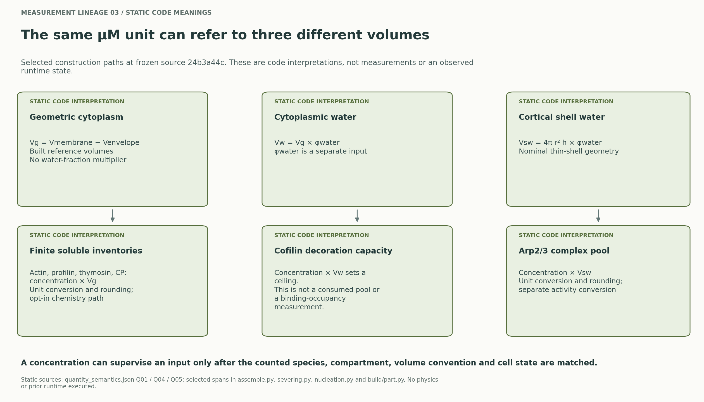
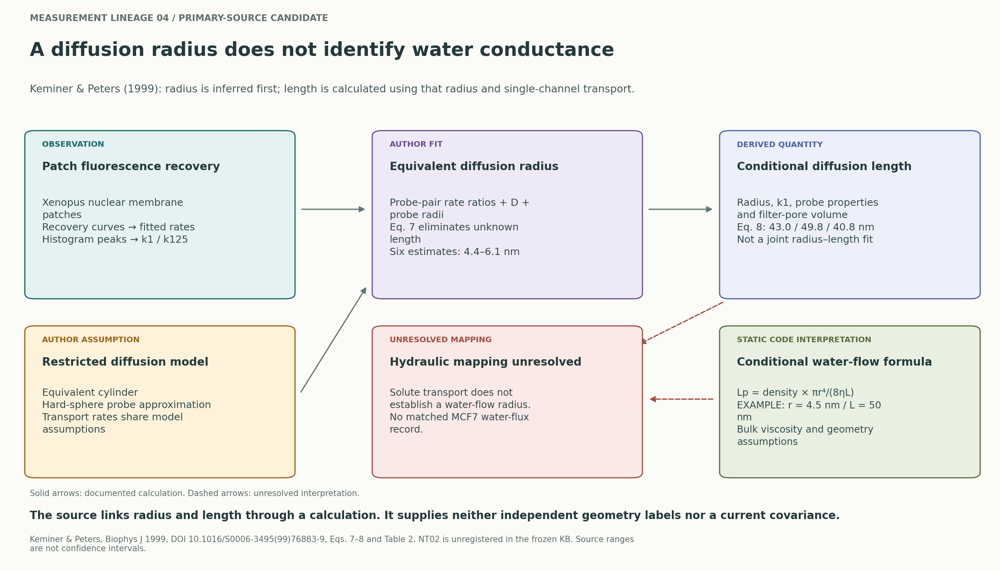
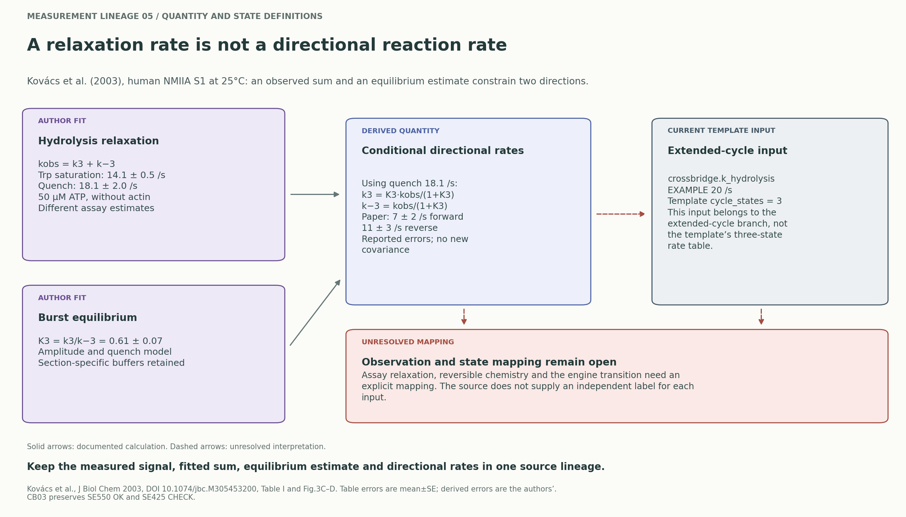
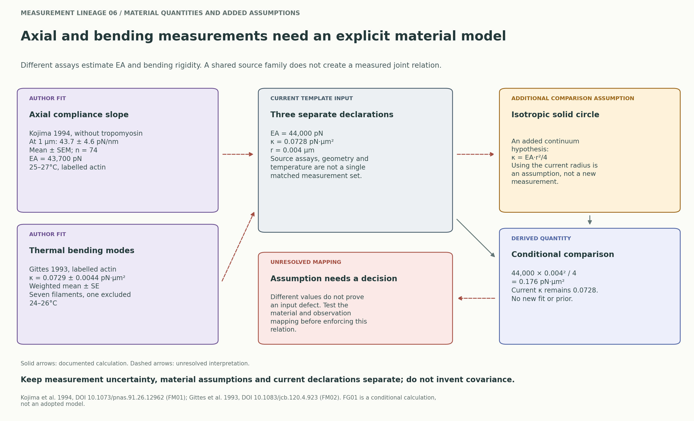

# 측정에서 입력까지의 경로

숫자를 옮기기 전에 관측량·가정·적합값·계산값·현재 입력의 의미를 구분하는 연구 그림입니다. 실선은 기록된 계산, 점선은 아직 성립하지 않은 대응입니다. 생물학적 인과그래프나 파라미터 상관행렬이 아닙니다. 현재 값·태그·prior는 그대로 두었습니다.

## 1. 액틴의 가정된 총량과 계산된 분획

[PDF](lineage_actin_pool.pdf) · [SVG](lineage_actin_pool.svg)

Kiuchi 등은 MCF7 세포에서 jasplakinolide 처리에 따른 상대 FDAP 동역학을 관찰했습니다. 모델에서는 G-actin·profilin·thymosin 총량을 각각 100·10·200 µM로 고정하고, free barbed ends B=4.8 nM와 Kvi=120 nM를 적합했습니다. 그 조건에서 free G=1.98, profilin–actin=9.52, thymosin–actin=88.5 µM가 계산됩니다. 합계 100은 고정한 총량을 반영하므로 세 개의 독립 농도 관측으로 학습시키면 안 됩니다. 현재 입력의 profilin 50과 free G 0.5 µM도 이 분석의 공동 측정값이 아닙니다. [원문 Fig. 3·Methods](https://pmc.ncbi.nlm.nih.gov/articles/PMC3080261/)

이 출처는 고정 KB에 등록되지 않은 후보입니다. [AP02](actin_pool_evidence.md)의 출처·맥락 검토와 `source_comparison_groups`를 보존하고, 현재 입력의 `same_fit_groups`는 비워 두었습니다.

## 2. NMII heavy-chain 비율에서 객체 비율까지

[PDF](lineage_nmii_fraction.pdf) · [SVG](lineage_nmii_fraction.svg)

Smutny 등의 adherent MCF7 자료에서 보고한 중심 비율은 A/B/C=54.8/12.5/32.5%입니다. A와 B만 분모에 넣으면 A 비율은 0.8143이 되지만, 이는 IIC를 제외한 peptide-abundance 비율입니다. 모델은 조립된 객체와 휴면 객체를 포함한 전체 할당 minifilament를 A/B로 나눕니다. peptide 반응 보정, isoform별 조립분율, 객체당 분자 수, mixed filament, 세포 상태의 변환이 해결되지 않았습니다. 원문의 오차 표기도 Results의 SEM과 Methods의 SD가 다릅니다. [원문 Results·Methods](https://pmc.ncbi.nlm.nih.gov/articles/PMC3428211/)

현재 `nmii.isoform_iia_fraction=1.0`을 유지합니다. 0.8143은 대체값·학습 정답·초기 활성 객체 비율로 승인되지 않았습니다. [MP01·M01 검토](motor_population_evidence.md)와 [Q08 코드 수량 사전](quantity_semantics.md)을 함께 읽어야 합니다.

## 3. 같은 µM의 서로 다른 공간 분모

[PDF](lineage_concentration_denominators.pdf) · [SVG](lineage_concentration_denominators.svg)

고정 소스 `24b3a44c`에서 조사한 경로는 다음과 같습니다.

| 입력·코드 해석 | 사용하는 부피 | 남은 대응 문제 |
|---|---|---|
| 용존 actin/PFN/thymosin/CP 인벤토리 | membrane.volume0 − envelope.volume0 | 선택적 finite chemistry 경로, free/bound와 준비 단계 |
| cofilin decoration capacity | 기하학적 세포질 × 물분율 | 소비되는 단백질 pool·결합 점유율 측정과 다름 |
| Arp2/3 complex pool | 얇은 피질 껍질 × 물분율 | intact complex, 피질 구획, activity 변환 |

`capping_conc`는 tip 결합 전 가용 CP 총량을 초기화합니다. 준비가 끝난 뒤 free CP는 초기 tip 점유량만큼 줄어듭니다. 농도를 연결할 때는 분모 외에 준비 단계도 기록해야 합니다. [17개 입력·10개 변환의 코드 위치와 한계](quantity_semantics.md)

## 4. 핵공의 확산 반경과 유체 반경

[PNG](lineage_nuclear_transport.png) · [PDF](lineage_nuclear_transport.pdf) · [SVG](lineage_nuclear_transport.svg)

Keminer1999는 탐침별 수송률에서 반경을 먼저 추정하고, 그 반경과 단일 채널 수송률로 길이를 계산합니다. 반경과 길이가 연결되어 있다는 사실은 직접 측정한 두 기하량이나 현재 입력의 공분산을 제공하지 않습니다. 물의 유체 전도도에 필요한 반경으로 대응시키는 근거도 별도입니다. [원문 검토와 정확한 조건](nuclear_transport_evidence.md)을 함께 읽어 주세요.

## 5. 관측한 반응속도의 합과 방향별 속도

[PDF](lineage_crossbridge_hydrolysis.pdf) · [SVG](lineage_crossbridge_hydrolysis.svg)

Kovács2003의 NMIIA S1 실험에서 tryptophan과 quench 관측의 hydrolysis relaxation은 각각14.1±0.5/s와18.1±2.0/s입니다. 가역 단계에서는 이 값이 정·역방향 속도의 합입니다. 저자들은 quench값과 평형비0.61±0.07에서 방향별7±2/s,11±3/s를 보고합니다. 오차는 원문 표기를 보존했으며 여기서 공분산을 생성하지 않았습니다. 실험 종류와 Methods·figure caption의 buffer 차이도 [CB03](crossbridge_evidence.md)에 남았습니다.

현재 `crossbridge.k_hydrolysis=20/s`는 EXAMPLE 그대로이며, 확장 cycle의 입력입니다. 고정 template는3-state cycle을 선택하므로 이 값을 그 template의 실제 반응속도로 보고하지 않습니다. 저자 관측의 합을 미시적 정방향 속도로 자동 대체하지 않습니다. [원문 TableI·Fig3](https://doi.org/10.1074/jbc.M305453200)

## 6. 액틴의 인장·굽힘 계수와 추가 재료 가정

[PDF](lineage_actin_material.pdf) · [SVG](lineage_actin_material.svg)

Kojima1994의 인장 측정과 Gittes1993의 열적 굽힘 측정은 서로 다른 assay입니다. 전자는 tropomyosin 없는 1 µm 길이에서 43.7±4.6 pN/nm(평균±SEM, n=74), 후자는 한 filament를 제외한 가중 평균 굽힘 계수 0.0729±0.0044 pN·µm²(평균의 SE)를 보고합니다. 온도·장식 단백질·단면 가정도 각각 보존해야 합니다. [원문과 수량 정의](filament_material_evidence.md)

등방성 고체 원형 단면이라는 **추가 비교 가정**을 적용하면 κ=EA·r²/4입니다. 현재 선언 EA=44,000 pN과 r=0.004 µm를 대입한 값은 0.176 pN·µm²이고, 현재 독립 선언 κ=0.0728과 다릅니다. 이 차이는 가정을 조사할 이유이며 잘못된 입력의 증명이나 새 구속식의 승인이 아닙니다. 기존 값과 prior는 유지했습니다.

## 재현·해석 범위

`measurement_lineages.json`은 선언된 입력 파일의 SHA-256, 현재 선언의 원문 사본, 원문 카드, 노드 역할과 화살표를 보존합니다. renderer는 파일 변경과 선언 불일치, 학습 적격 승격, 공분산 입력을 거부합니다. `measurement_lineage_provenance.json`은 그림 생성 코드·환경을 기록합니다. 그림은 PNG/SVG/PDF로 내보냈으며 눈으로 텍스트와 배치를 확인했습니다.

이 검사는 문헌 해석 전체의 자동 증명이나 native 검증이 아닙니다. 시뮬레이션·prior 실행·신경망 학습은 이 그림 생성 과정에서 수행하지 않았습니다.
